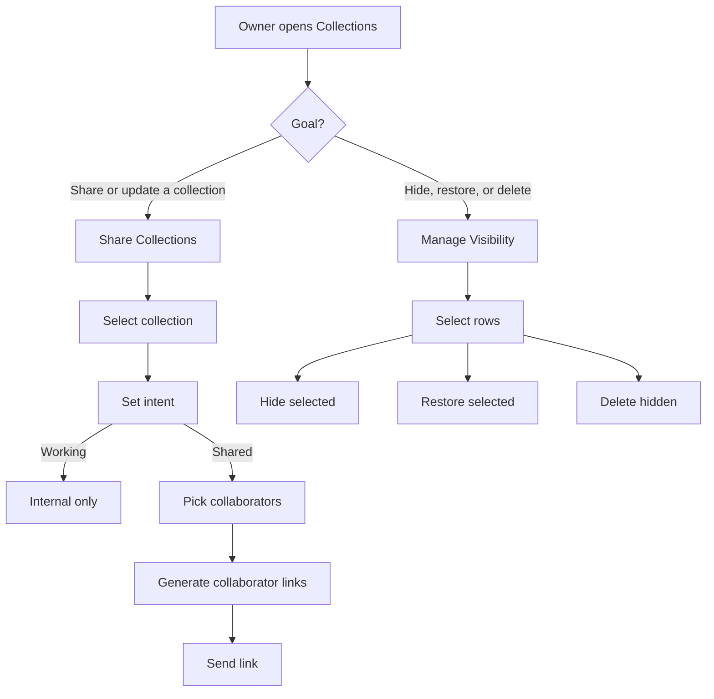

# Collections UI Split Plan — Share vs Hide/Unhide

> Legacy note (2026-05-27): the share/live-link half of this plan is retired.
> Keep collection visibility/maintenance ideas only if still useful for local
> corpus management. Current external handoff is PDF export.

Date: 2026-03-12
Project: Inspirations
Status: Proposed UX sprint slice

## Summary

The current `Manage Collections` dialog is trying to do too many jobs at once:

1. browse collections
2. edit collection metadata
3. assign collaborators and generate share links
4. bulk hide/unhide collections
5. act as an audit/provenance surface

That overload is now visible in the UI:

- the collection list is being used both as a picker and as a bulk-selection table
- the lower detail form is trying to be both an editor and a sharing workflow
- `Hide selected` / `Restore selected` / `Delete hidden` are mixed with sharing concerns
- the owner mental model has to switch back and forth between two unrelated tasks

The clean fix is to split the experience into **two distinct workflows**:

1. `Share Collections`
2. `Manage Visibility`

## Product Rules Already Agreed

These rules are already established and the UI should reflect them directly.

### Collection intent

Every collection has explicit intent:

- `working`
- `shared`

### Shared collections

Shared collections are collaboration objects.

Rules:

- every shared collection must name at least one collaborator
- questions are always enabled for shared collections
- collaborators should not see working collections
- neutral/unauthenticated mode must never expose more than collaborator mode

### Working collections

Working collections are internal workflow objects.

Examples:

- curation/review slices
- construction-track working sets
- cleanup/provenance cohorts
- internal debugging collections

### Construction rule

For now, construction-track collections should remain `working` collections. The construction branch needs its own workflow later and should not be forced into the style-side sharing UX.

## Problem Diagnosis

The current single dialog fails for structural reasons:

### Sharing is not a bulk action

Sharing requires:

- understanding collection intent
- selecting named collaborators
- generating collaborator-specific links
- reasoning about audience and purpose

That is a guided editorial task, not a checkbox table operation.

### Hide/unhide is not collaboration

Visibility management requires:

- selecting many collections quickly
- hiding or restoring them in bulk
- optionally deleting hidden collections

That is an administrative maintenance task. It should be fast, low-cognitive-load, and separate from sharing.

### Current failure mode

Because both workflows are merged:

- the left-side checkboxes feel ambiguous
- the row click target does too much
- the bottom editor feels like it changes context unexpectedly
- collaborator assignment is visually crowded into a maintenance surface

## Proposed Top-Level Design

Replace one overloaded `Manage Collections` dialog with two explicit entry points.

### Owner actions

In the sidebar / collections area:

- `+ New Collection`
- `Share Collections`
- `Manage Visibility`

`Manage Collections` as a generic label should go away.

## Workflow A — Share Collections

### Purpose

Create or edit audience-facing collections for a named collaborator.

### Audience

Owner only.

### Entry

Button: `Share Collections`

### Main layout

Two-column editor.

Left column:

- collection list
- filters:
  - `Working`
  - `Shared`
  - `All`
- optional badge summary:
  - `Shared with 2`
  - `Working`

Right column:

- collection name
- description
- intent selector
- collaborator picker
- collaborator link cards
- save/share actions

### Key design behavior

#### A. Collection selection

Selecting a collection on the left only changes the editor on the right. There are **no bulk checkboxes** in this workflow.

#### B. Intent handling

If `Intent = Working`:

- collaborator picker is disabled/hidden
- share links section shows explanatory text:
  - `Working collections are internal and are not visible to collaborators.`

If `Intent = Shared`:

- collaborator picker becomes active
- at least one collaborator is required
- per-collaborator links are generated

#### C. Collaborator picker

Rows should read left-to-right:

- checkbox
- collaborator name
- muted role text

Example row:

- `[x] Mark (Builder)`
- `builder`

#### D. Share links

Share links are secondary and generated.

Each selected collaborator gets a compact card:

- name
- role
- `Copy link`
- optional `Open as collaborator`

### Required copy

- `Share Collections`
- `Intent`
- `Share with`
- `Shared collections require at least one named collaborator. Questions are always enabled.`

### Out of scope for this first slice

- email sending
- role templates
- invite status
- expiration / revocation

## Workflow B — Manage Visibility

### Purpose

Hide, restore, and delete collections in bulk.

### Audience

Owner only.

### Entry

Button: `Manage Visibility`

### Main layout

Single-purpose table/list.

Tabs or segmented control:

- `Active`
- `Hidden`

Each row contains:

- checkbox
- collection name
- count
- provenance/intent badge summary

No lower detail editor.

### Bulk actions

For `Active` tab:

- `Hide selected`

For `Hidden` tab:

- `Restore selected`
- `Delete hidden`

### Key design behavior

- row checkbox is only for bulk action selection
- row click should not open a sharing editor inside this screen
- if detail inspection is needed later, that should open a separate view or jump to `Share Collections`

## Why the Split Helps

### Sharing becomes legible

The user can think:

- which collection?
- is it working or shared?
- who gets it?
- what link do I send?

### Visibility becomes fast

The user can think:

- which collections should be hidden?
- which hidden collections should come back?

No collaborator or metadata form is mixed into that decision.

### It matches intent

The UI now directly mirrors the product model:

- `working` vs `shared`
- collaboration vs maintenance

## Proposed Flow Diagrams



## Detailed Wireframe Notes

### Share Collections

```text
+---------------------------------------------------------------+
| Share Collections                                             |
|---------------------------------------------------------------|
| [Working] [Shared] [All]             + New Collection         |
|                                                               |
| Collections                 | Details                         |
|----------------------------|---------------------------------|
| Leslie Kitchen Set   Shared| Name                            |
| Tile Ideas           Working| [............................] |
| Architect Briefing   Shared| Description                     |
| CB: Cabinetry        Working| [............................] |
|                            | Intent                          |
|                            | [Shared v]                      |
|                            |                                 |
|                            | Share with                      |
|                            | [x] Mark (Builder)              |
|                            | [ ] Architect Team              |
|                            | [ ] Chris Weyrich               |
|                            |                                 |
|                            | Share links                     |
|                            | Mark (Builder)   [Copy link]    |
|                            |                                 |
|                            |                       [Save]     |
+---------------------------------------------------------------+
```

### Manage Visibility

```text
+---------------------------------------------------------------+
| Manage Visibility                                             |
|---------------------------------------------------------------|
| [Active] [Hidden]                                             |
|                                                               |
| [ ] Architect Briefing                     Shared      28      |
| [ ] CB: Cabinetry                          Working     52      |
| [ ] Review: Source Link Conflicts          Working    158      |
|                                                               |
| [Hide selected]                                            |
|                                                               |
| Hidden tab:                                                   |
| [Restore selected]   [Delete hidden]                         |
+---------------------------------------------------------------+
```

## Interaction Rules

### Share Collections screen

- no bulk-selection checkboxes in the collection list
- list rows are single-select
- editor always reflects the selected collection
- save is explicit
- links update only after valid collaborator selection

### Manage Visibility screen

- only bulk-selection checkboxes
- no collaborator controls
- no intent editing
- no link generation

## Migration Path From Current UI

### Phase 1

- Keep existing data model and API
- Replace `Manage Collections` button with:
  - `Share Collections`
  - `Manage Visibility`
- Reuse current collection update API for the share screen
- Reuse current hide/restore/delete endpoints for the visibility screen

### Phase 2

- Add better collaborator summaries in collection rows
- Add direct `Open as collaborator` preview from share screen
- Add collection-specific landing polish for collaborators

### Phase 3

- Add invite/send affordances if needed
- add collection activity / questions summary if useful

## Recommendation

Implement the split now, before polishing either workflow further.

Do **not** continue evolving the current combined modal. It is structurally wrong for the two jobs it is trying to do.

## Immediate Next Build Slice

1. Rename current `Manage Collections` flow to `Share Collections` conceptually.
2. Remove bulk hide/restore controls from that surface.
3. Create a separate `Manage Visibility` modal.
4. Keep all existing backend behavior; only split the UI first.

That will give us the biggest usability improvement for the least product risk.
