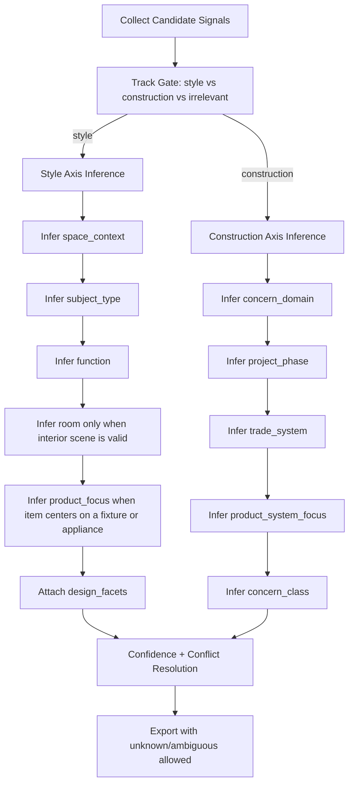

# Curation Confidence And Hierarchy Spec

Date: 2026-03-05, revised 2026-03-06  
Status: Design proposal (no implementation changes in this doc)

## Why this exists

The current curation flow can produce compounding errors:

- Weak or synthetic fields (especially `title`) can influence classification.
- Room assignment is overloaded as the primary style taxonomy.
- A single keyword can force a room assignment even when item context is mixed or ambiguous.

This document defines a more reliable hierarchy and confidence model.

## Modeling stance

Hierarchy is useful, but exclusivity should be earned, not assumed.

- Treat most memberships as non-exclusive by default.
- Allow multiple valid memberships at the same level when the asset genuinely supports them.
- Only collapse to a single value when the evidence strongly supports exclusivity.
- Prefer `unknown` / `ambiguous` over false certainty.

This matters because many inspiration assets are hybrid:

- an outdoor dining scene is both `outdoor_zone` and `function=dining`
- a close-up of a sink may belong to bathroom intent while also being a product-focused item
- a ZIP System reference can be both an envelope concern and a specific system/product focus

## Primary goals

1. High confidence discrimination between:
   - `style_product_decor`
   - `construction_concern`
2. High confidence categorization within each track:
   - Construction: concern themes and planning structure
   - Style: room context plus additional peer-level dimensions

## Evidence from current corpus

From scope `triage_status in (pending, keeper)`:

- Candidates: `4663`
- If `title` is blanked in heuristic mode:
  - `69` items change track
  - `99` items change room
  - `46 / 3050` style items change room
- `17` items are assigned `dining_room` while also carrying outdoor signals (`patio`, `garden`, `outdoor`, etc.).
- Missing context:
  - `150` missing board
  - `64` missing labels
  - `47` missing both board and labels

Reference: `data/exports/provenance_audit_20260305.json`

## Core diagnosis

Current style grouping is effectively single-axis (`style -> room`).  
Real data is multi-axis and often non-exclusive.

A patio dining scene is not an interior dining room, even if the function is dining.
The missing distinction is between:

- Space context (indoor/outdoor/non-spatial)
- Function (dining/cooking/sleeping)
- Subject type (full room/product/detail)
- Product or system focus (named product families, equipment classes, assemblies)

## Proposed hierarchy model

### 1) Top gate (hard)

- `track`:
  - `style_product_decor`
  - `construction_concern`
  - `irrelevant`

### 2) Style track axes (peer-level)

Do not force all style items into `room`.

| Axis | Purpose | Example values |
|---|---|---|
| `space_context` | Physical context of scene | `interior_room`, `outdoor_zone`, `transition_space`, `whole_home`, `non_spatial` |
| `subject_type` | What the asset primarily is | `full_space_scene`, `vignette_styling`, `single_product`, `material_finish`, `architectural_detail`, `plan_drawing` |
| `function` | Functional intent | `dining`, `cooking`, `sleeping`, `bathing`, `storage`, `circulation`, `utility`, `entertaining` |
| `room` (conditional) | Interior room only when valid | `kitchen`, `bathroom`, `bedroom`, `living_room`, `dining_room`, ... |
| `product_focus` | Specific product or fixture class when the item centers on one | `range`, `refrigerator`, `dishwasher`, `sink`, `toilet`, `tub`, `faucet`, `lighting_fixture`, `vanity`, `hardware` |
| `design_facets` | Reusable style descriptors | styles, palette, materials, element focus, decor motifs |

Rule: `room` is assigned only if `space_context=interior_room` and `subject_type=full_space_scene` (or strong interior scene evidence).

`product_focus` is not subordinate to `room`. A sink can be bathroom-related without requiring a full bathroom room assignment.

### 3) Construction track axes (peer-level)

| Axis | Purpose | Example values |
|---|---|---|
| `concern_domain` | Existing concern theme | `site_exterior`, `envelope`, `structure`, `mep`, `plans_code_permits`, `interiors_execution` |
| `project_phase` | Where concern applies | `concept`, `design`, `permit_code`, `procurement`, `build`, `commissioning_closeout` |
| `trade_system` | Trade/system ownership | `structural`, `envelope`, `mechanical`, `electrical`, `plumbing`, `site`, `millwork_finish`, `multi_trade` |
| `concern_class` | Concern type semantics | `risk`, `decision`, `requirement`, `checklist`, `reference_example` |
| `product_system_focus` | Specific product family, named assembly, or equipment class under discussion | `water_heater`, `tankless_water_heater`, `zip_system`, `window_system`, `waterproofing_membrane`, `insulation_system`, `roofing_system`, `duct_system` |

`trade_system` stays broad. `product_system_focus` captures the specific thing being evaluated or repeated across references.

## Confidence model (provenance-aware)

### Principle

Not all fields are equal. Each field needs both:

- `origin` (where it came from)
- `trust_weight` (how much influence it should have)

### Suggested signal tiers

Tier 1 (highest trust):

- User board intent when board semantics are clear
- Human-reviewed labels/overrides

Tier 2:

- Source-native structured metadata (when stable)
- Strong AI vision tags with high confidence and low contradiction

Tier 3:

- Imported text titles/descriptions
- AI-generated summaries
- Heuristic keyword expansions

### Decision logic

Use weighted voting per axis, not first-hit keywords.

`score(axis_value) = sum(signal_weight * signal_confidence * provenance_weight)`

Then:

- Accept if top score exceeds threshold and separation margin.
- Else assign `unknown` / `ambiguous`.

No forced assignment when evidence conflicts.

Important: this scoring is per axis, not one global winner-take-all label. An asset may carry multiple accepted memberships across peer-level axes.

## Proposed classification flow

## Conflict policy

When signals disagree:

- If outdoor evidence is strong and dining evidence is strong:
  - `space_context=outdoor_zone`
  - `function=dining`
  - `room=null`
- If an item is clearly a product close-up:
  - allow `product_focus=<value>`
  - do not force `room`
- If a construction item clearly references a named system or equipment family:
  - allow `product_system_focus=<value>`
  - do not force that field to substitute for `concern_domain` or `trade_system`
- If no dominant winner:
  - assign `unknown` / `ambiguous`
  - preserve evidence vector for human review

Do not coerce to nearest room.

## Example outcomes

### Example A: Patio table scene

Current misfire: `room=dining_room`  
Proposed:

- `track=style_product_decor`
- `space_context=outdoor_zone`
- `subject_type=full_space_scene`
- `function=dining`
- `room=null`
- `design_facets=[...]`

### Example B: Bathroom faucet close-up

Proposed:

- `track=style_product_decor`
- `space_context=interior_room` (weak)
- `subject_type=single_product`
- `function=bathing`
- `product_focus=sink` or `faucet`
- `room=null` (not enough full-room evidence)

### Example C: Foundation detail and waterproofing note

Proposed:

- `track=construction_concern`
- `concern_domain=structure` or `envelope` (by evidence)
- `project_phase=build`
- `trade_system=structural` or `envelope`
- `product_system_focus=waterproofing_membrane` or other named assembly if present
- `concern_class=risk` or `requirement`

### Example D: ZIP System reference

Proposed:

- `track=construction_concern`
- `concern_domain=envelope`
- `trade_system=envelope`
- `product_system_focus=zip_system`
- `concern_class=reference_example` or `requirement`

### Example E: Range appliance inspiration

Proposed:

- `track=style_product_decor`
- `subject_type=single_product`
- `function=cooking`
- `product_focus=range`
- `room=null` unless the asset is also a valid full kitchen scene

## Data contract additions (recommended)

Per asset classification payload should include:

- `track`
- `track_confidence`
- `space_context`, `space_context_confidence` (style only)
- `subject_type`, `subject_type_confidence` (style only)
- `function`, `function_confidence` (style only)
- `room` (nullable), `room_confidence` (style only)
- `product_focus[]`, `product_focus_confidence` (style only; multi-valued allowed)
- `concern_domain`, `project_phase`, `trade_system`, `concern_class` (+ confidences, construction only)
- `product_system_focus[]`, `product_system_focus_confidence` (construction only; multi-valued allowed)
- `is_ambiguous` (boolean)
- `evidence` object with weighted contributors

Per source field provenance metadata should include:

- `title_origin` (`imported`, `ai_suggested`, `title_audit`, `manual_edit`, etc.)
- `title_last_mutated_at`
- `title_mutator`
- Similar metadata for `description`, `board`, and key labels where possible

## Success metrics

### Track discrimination

- Precision/recall for style vs construction on reviewed sample
- Target: materially lower cross-track contamination than current baseline

### Style categorization quality

- Outdoor dining incorrectly forced into interior room should trend toward zero.
- Reduced `room` assignment when `subject_type != full_space_scene`.
- Reviewer agreement rate on `space_context` and `subject_type`.
- Reviewer agreement rate on `product_focus` for fixture/appliance-led style items.

### Construction categorization quality

- Reviewer agreement on `concern_domain`
- Higher planning usefulness from `project_phase` and `concern_class`
- Reviewer agreement on `product_system_focus` for named assemblies and equipment classes.

## Rollout strategy

1. Phase 1: Provenance instrumentation
   - Add field-origin metadata and mutation history pointers.
2. Phase 2: Multi-axis inference without changing export grouping defaults
   - Run side-by-side with existing room-only output.
3. Phase 3: Confidence gating and ambiguity handling
   - Enable `unknown` paths.
4. Phase 4: Export and UI updates
   - Present room only when valid; preserve function/context axes.

## Immediate recommendation

Before additional ranking tuning:

1. Lock taxonomy design for the multi-axis model.
2. Implement provenance-aware confidence scoring.
3. Introduce ambiguity handling and stop forced room assignment.
4. Use pairwise only after trusted categorization, not as a fix for categorization errors.

## Future synthesis phase: generative mood boards

After classification and representative selection are stable, add a separate
downstream synthesis phase for generated mood boards.

Purpose:

- Use the corpus to derive representative theme exemplars.
- Feed a diverse but still representative seed set into a generative model.
- Ask for a synthetic mood board, for example `15` images, that reflects the
  theme without copying the corpus one-for-one.

Important boundaries:

- Generated images are not evidence.
- Generated images are not ground truth about Leslie's corpus.
- Generated images should not be mixed back into the source corpus as if they
  were collected references.
- This phase should happen only after:
  1. track discrimination is trustworthy
  2. multi-axis categorization is trustworthy
  3. representative-image selection is defensible

Recommended implementation shape:

1. Select a classified theme or sub-theme from the source corpus.
2. Pick representative images that cover local poles or meaningful variants,
   not many near-duplicates.
3. Preserve the source asset ids and rationale for why each seed image was chosen.
4. Generate the synthetic mood board as a separate artifact family.
5. Present the result as a design probe for review, not as a factual summary.

This can be a valuable downstream design tool, but it should remain clearly
separate from the evidence and classification layers.
