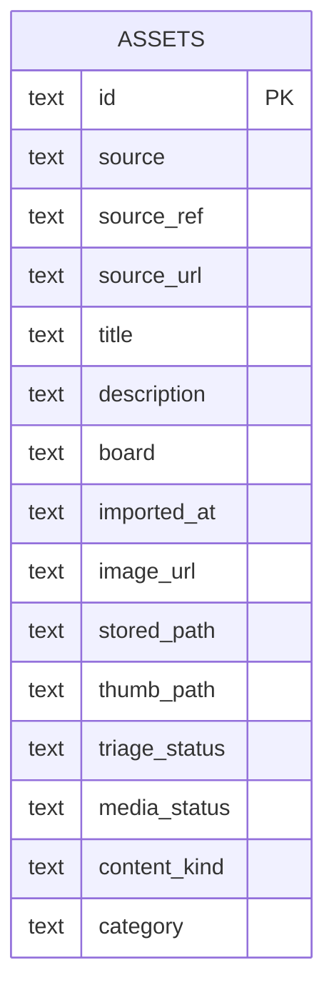
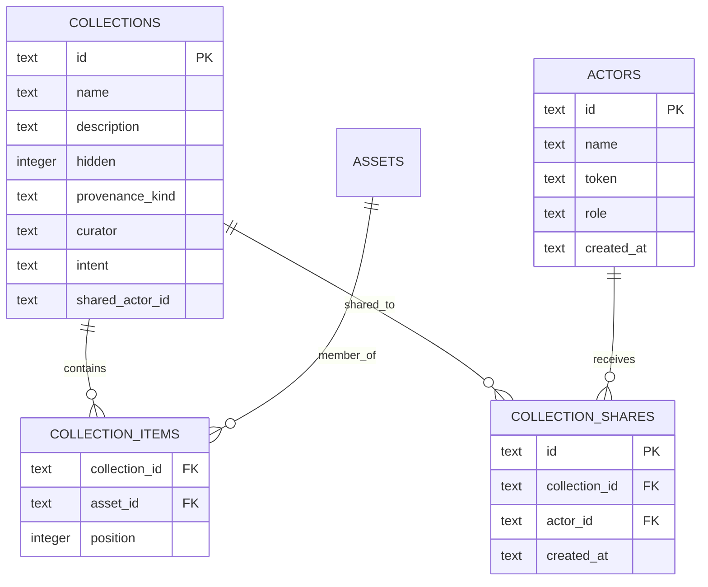
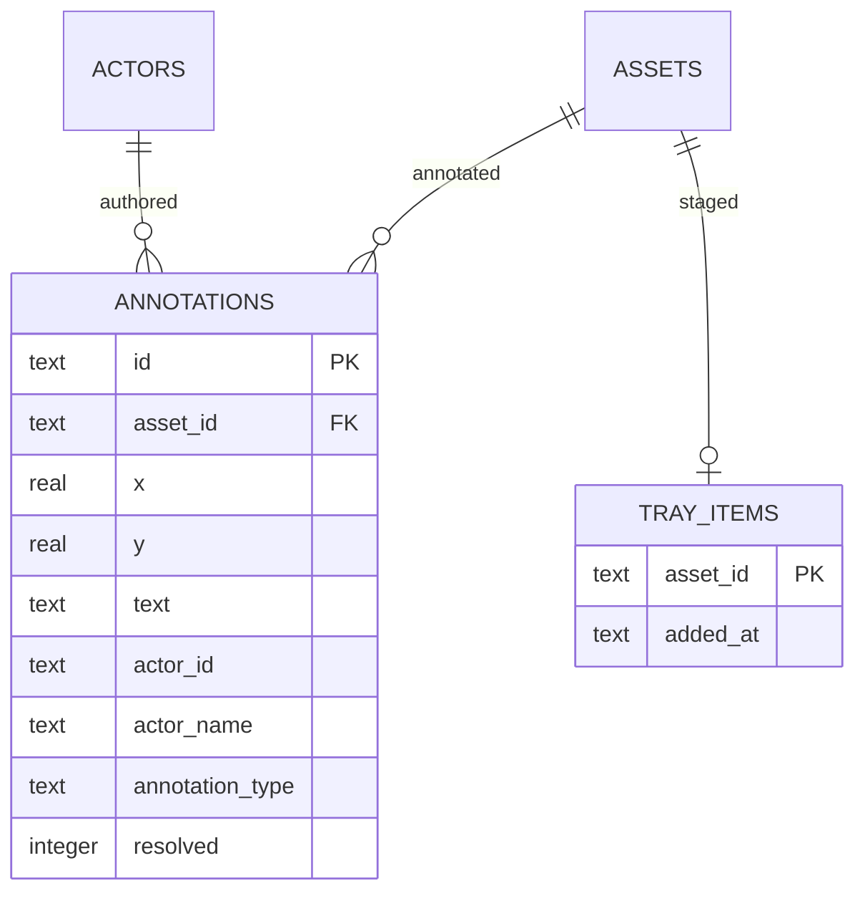
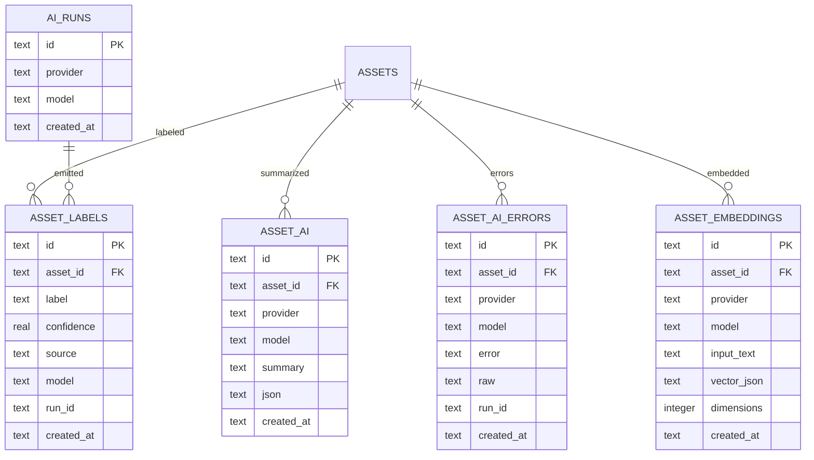
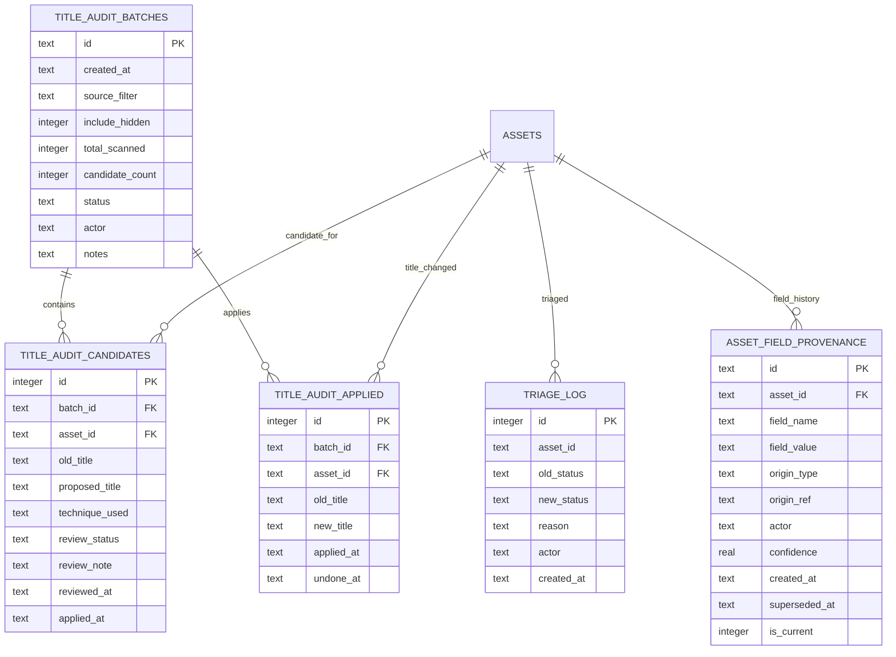
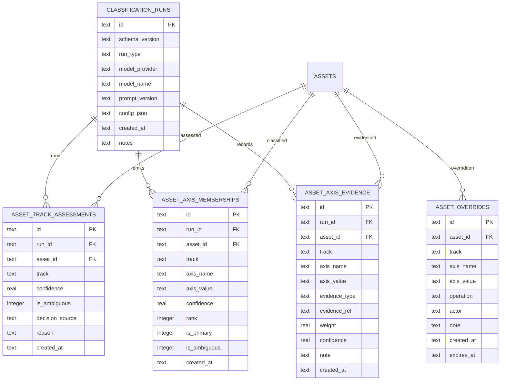
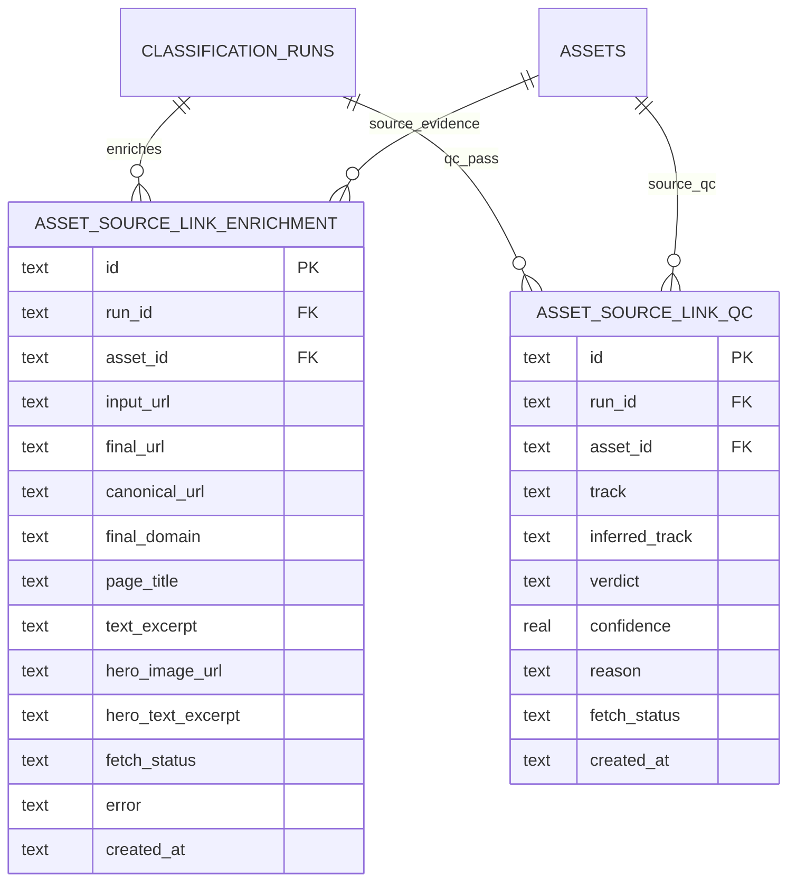
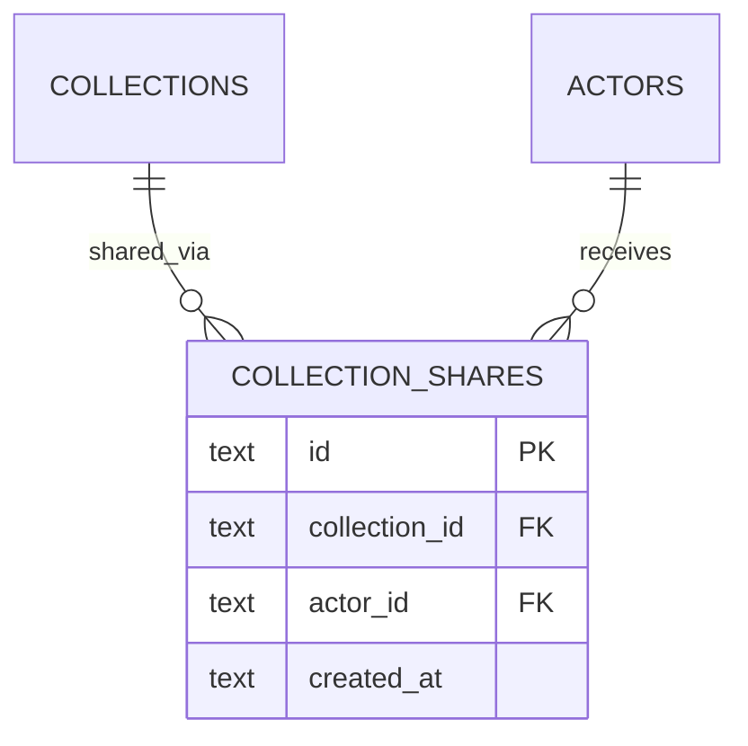

# Current Data Model

Date: March 12, 2026 (updated March 20, 2026 for collection sharing normalization)
Source of truth: `/Users/minime/Projects/Inspirations/src/inspirations/db.py`

This document describes the current persisted data model for Inspirations as it exists in code today. It is intentionally descriptive, not aspirational.

## Overview

The system currently has 8 main data domains:

1. Core corpus assets
2. Collections and collaboration
3. Annotations and tray workflow
4. AI analysis and embeddings
5. Source bucketing
6. Title audit and title provenance
7. V2 classification and human overrides
8. Source-link enrichment and QC

## Whole-System Map

```mermaid
erDiagram
    ASSETS ||--o{ COLLECTION_ITEMS : contains
    COLLECTIONS ||--o{ COLLECTION_ITEMS : groups
    ASSETS ||--o{ ANNOTATIONS : annotated_by
    ACTORS ||--o{ ANNOTATIONS : authored
    ASSETS ||--o| TRAY_ITEMS : staged

    ASSETS ||--o{ ASSET_AI : summarized_by
    ASSETS ||--o{ ASSET_LABELS : labeled_by
    ASSETS ||--o{ ASSET_AI_ERRORS : failed_ai
    ASSETS ||--o{ ASSET_EMBEDDINGS : embedded_as
    AI_RUNS ||--o{ ASSET_LABELS : produced

    ASSETS ||--o{ TRIAGE_LOG : triaged

    TITLE_AUDIT_BATCHES ||--o{ TITLE_AUDIT_CANDIDATES : stages
    TITLE_AUDIT_BATCHES ||--o{ TITLE_AUDIT_APPLIED : applies
    ASSETS ||--o{ TITLE_AUDIT_CANDIDATES : candidate_for
    ASSETS ||--o{ TITLE_AUDIT_APPLIED : title_changed
    ASSETS ||--o{ ASSET_FIELD_PROVENANCE : field_history

    CLASSIFICATION_RUNS ||--o{ ASSET_TRACK_ASSESSMENTS : evaluates
    CLASSIFICATION_RUNS ||--o{ ASSET_AXIS_MEMBERSHIPS : assigns
    CLASSIFICATION_RUNS ||--o{ ASSET_AXIS_EVIDENCE : records
    CLASSIFICATION_RUNS ||--o{ ASSET_SOURCE_LINK_ENRICHMENT : enriches
    CLASSIFICATION_RUNS ||--o{ ASSET_SOURCE_LINK_QC : qc_pass

    ASSETS ||--o{ ASSET_TRACK_ASSESSMENTS : track_scored
    ASSETS ||--o{ ASSET_AXIS_MEMBERSHIPS : axis_membership
    ASSETS ||--o{ ASSET_AXIS_EVIDENCE : evidence_for
    ASSETS ||--o{ ASSET_OVERRIDES : manually_overridden
    ASSETS ||--o{ ASSET_SOURCE_LINK_ENRICHMENT : source_enriched
    ASSETS ||--o{ ASSET_SOURCE_LINK_QC : source_qc

    SOURCE_COLLECTIONS }o--|| ASSETS : mirrored_from_source
    COLLECTIONS ||--o{ COLLECTION_SHARES : shared_to
    ACTORS ||--o{ COLLECTION_SHARES : receives
```

## 1. Core Corpus Assets

### `assets`

Primary corpus table. Every imported item lands here first.

Important fields:
- identity and provenance: `id`, `source`, `source_ref`, `source_url`, `source_domain`, `source_name`
- descriptive text: `title`, `description`, `board`, `notes`, `ai_summary`, `post_text`
- media: `image_url`, `stored_path`, `thumb_path`, `stored_video_path`, `video_duration`
- scrape metadata: `seo_alt_text`, `closeup_desc`, `hashtags`, `dominant_color`, `image_width`, `image_height`, `engagement_json`, `scrape_json`
- workflow state: `triage_status`, `triage_at`, `needs_annotation`
- legacy categorization: `category`
- anomaly flags: `flagged*`, `tagged*`
- ingestion classification hints: `media_status`, `content_kind`, `creator_name`

Indexes:
- unique `(source, source_ref)`
- source, imported_at, sha256, media_status, content_kind, creator_name, source_domain, triage_status

### Core asset relationships

## 2. Collections and Collaboration

### `collections`

Named groupings of assets.

Current fields:
- identity: `id`, `name`, `description`, `created_at`, `updated_at`
- visibility / archival: `hidden`, `hidden_at`
- provenance: `provenance_kind`, `provenance_note`, `curator`
- sharing model: `intent`, `shared_actor_id`

Current `intent` values:
- `working`
- `shared`

### `collection_shares`

Normalized collection-to-actor sharing join table.

Fields:
- `id`
- `collection_id`
- `actor_id`
- `created_at`

Current sharing behavior:
- `collections.shared_actor_id` remains as a compatibility bridge / first shared actor
- `collection_shares` is now the actual many-collaborator model
- collaborator collection visibility is enforced from these fields
- collection-scoped shared links and collection-scoped asset browsing are expected to honor this access model

Current limitation:
- the schema is now normalized enough for one-collection-to-many-collaborators, but the owner-side sharing UX is still mid-sprint rather than fully polished

### `collection_items`

Join table from collections to assets, with ordering.

### `actors`

Magic-link identities.

Fields:
- `id`, `name`, `token`, `role`, `created_at`

Current roles:
- `owner`
- `collaborator`

### Collections / collaboration diagram

## 3. Annotations and Tray Workflow

### `annotations`

Image-anchored notes and questions.

Fields:
- `id`, `asset_id`, `x`, `y`, `text`, `created_at`, `updated_at`
- attribution / question workflow: `actor_id`, `actor_name`, `annotation_type`, `resolved`

### `tray_items`

Temporary staging area for building collections from selected assets.

### Diagram

## 4. AI Analysis and Embeddings

### `ai_runs`
Metadata for AI runs.

### `asset_ai`
Freeform AI summaries and provider JSON.

### `asset_labels`
Normalized labels per asset.

### `asset_ai_errors`
AI failures for diagnostics.

### `asset_embeddings`
Stored vector embeddings.

### Diagram

## 5. Source Bucketing

### `source_collections`

Importer-level source mirrors and buckets.

Fields:
- `id`, `source`, `source_ref`, `name`, `created_at`, `imported_at`

This is source-provenance organization, not user collections.

## 6. Triage, Titles, and Provenance

### `triage_log`
Append-only audit trail for triage status changes.

### `title_audit_batches`
CLI-first title audit batches.

### `title_audit_candidates`
Potential title changes in a batch.

### `title_audit_applied`
Applied title changes.

### `asset_field_provenance`
General field history table, currently important for `title` and `source_url` provenance.

### Diagram

## 7. V2 Classification Layer

This is the current side-by-side classification system. It preserves evidence and human overrides without overwriting legacy corpus fields.

### `classification_runs`
A run record for each classification or enrichment pass.

### `asset_track_assessments`
Top-level track decision per asset per run.

Current tracks:
- `style_product_decor`
- `construction_concern`
- `home_maintenance_diy`
- `irrelevant`

### `asset_axis_memberships`
Multi-axis memberships such as:
- `space_context`
- `subject_type`
- `room`
- `product_focus`
- `concern_domain`
- `product_system_focus`
- `project_phase`
- etc.

### `asset_axis_evidence`
Why an axis membership was inferred.

### `asset_overrides`
Human override layer, including persistent track review outcomes.

### Diagram

## 8. Source-Link Enrichment and QC

### `asset_source_link_enrichment`
Stores fetched source-page evidence.

Fields include:
- input/final/canonical URL
- page title and description
- text excerpt
- hero image URL and alt
- hero text excerpt
- fetch status and error

### `asset_source_link_qc`
Stores the review result of whether source-link evidence supports or conflicts with the current classification.

### Diagram

## Current Collection/Sharing Constraint

The current schema now supports:
- collection `intent`
- single named collaborator via `shared_actor_id`

That is enough for the first share workflow slice, but it does not match the newly identified likely reality:
- one collection may often be shared with many collaborators

That is now partially addressed by a real join table: `collection_shares`.

Current status:
- `collection_shares` is now part of the persisted schema
- `collections.shared_actor_id` still exists as a compatibility bridge / legacy primary share field
- the next cleanup step is to decide whether `shared_actor_id` remains as a denormalized convenience field or is retired later

## Practical Reading of the Current Model

The most important current distinctions are:

- `assets` is the canonical corpus table
- `collections` is now intent-bearing, but still only partially collaboration-aware
- `actors` powers magic-link identity and role
- v2 classification lives beside the legacy asset fields, not on top of them
- source-link evidence is now first-class and separate from classification judgment
- title/source provenance is first-class history, not an inferred UI trick

## Known Pressure Points

1. Collection sharing is now normalized enough for one-to-many collaborators, but the UI is still only partially adapted to that model.
2. Construction workflow likely wants different objects/actions than style-side shared collections.
3. `subject_type` may need refinement for exploration value in 3DE.
4. Scan page assets and logical scan documents are still not fully normalized into separate persisted entities.
5. Source mirrors, working collections, workflow review collections, and shared collections now coexist in one table, with intent/provenance doing the separation.

## Suggested Next Schema Step

For the collections/share sprint, the next likely schema evolution is now:

1. Build owner UI on top of `collection_shares`
2. Keep `collections.intent`
3. Treat `shared_actor_id` as transitional or deprecate it after UI migration
4. Keep questions always enabled for shared collections in application logic
